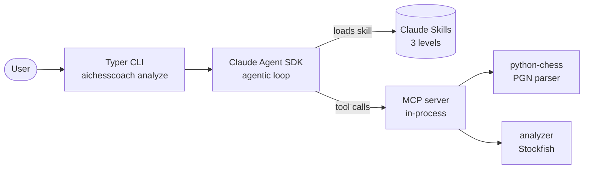

# AIchessCoach

> Chess Coach Agent — identifies and explains the key moments of a chess game in natural language, adapted to the player's skill level.

## What it does

Give it a chess game (PGN to start — FEN sequences and GIF on the roadmap), and the agent:

1. Walks through the game move by move
2. Detects **key moments** — blunders, brilliant moves, turning points
3. Explains them in **plain language**, calibrated to a configurable skill level (beginner / intermediate / advanced)

## Why this repo

A focused portfolio project demonstrating hands-on use of modern AI engineering primitives:

- **Agentic loop** — orchestrated with the Claude Agent SDK
- **Tool use** — Stockfish-powered evaluation exposed as first-class tools
- **MCP server** — chess analysis tools exposed via the Model Context Protocol
- **Claude Skills** — coaching style packaged as reusable skills per player level
- **Modern Python** — `uv`, `pyproject.toml`, `src/` layout, `typer` CLI

## Demo

Real coaching output produced by the CLI on the Fool's Mate (`1. f3 e5 2. g4 Qh4#`) at the beginner level:

```bash
uv run aichesscoach analyze fools_mate.pgn --level beginner
```

<details>
<summary>Click to expand the full coaching output</summary>

Here's your coaching breakdown! 🎓

---

### Game Overview: The Fool's Mate

You just experienced the **Fool's Mate** — the fastest checkmate possible in chess (only 2 moves for White!). It's a painful lesson, but an incredibly important one. Let's look at exactly what went wrong.

---

#### ⚠️ Move 1 — **f3** (Mistake)

**What happened:** White moved the f-pawn forward one square. This looks harmless, but it actually *weakens the king's safety* right away.

**Why it's a problem:** Imagine an invisible diagonal line stretching from e1 (where your king starts) all the way to h4. Moving the f-pawn unblocks that diagonal, meaning your king is now exposed to attacks from that direction.

**What to look for next time:** Before moving a pawn in front of your king, ask yourself: *"Does this open a line toward my king?"* Pawns protecting the king are valuable shields — don't move them without a good reason.

---

#### 💀 Move 2 — **g4** (Blunder → Instant Checkmate)

**What happened:** White moved the g-pawn forward, and Black immediately played **Qh4#** — checkmate. Game over.

**Why it's a problem:** The g4 move *completely opened* the diagonal toward your king. The Black queen swooped to h4, and there was no way to block her or capture her. Your king was checkmated on move 2.

**What to look for next time:** Be very careful about moving the f- and g-pawns early in the game. These two pawns are your king's closest bodyguards. Moving both of them creates a gaping hole right in front of your king.

---

#### 🔑 The Big Lesson: King Safety Comes First

In the opening (the first several moves of a game), your **#1 priority** is to keep your king safe. Here's a simple rule to remember:

> **Don't move the pawns directly in front of your king unless you have a very good reason.**

A better plan for White would have been to open up the center (moves like **e4** or **d4**), develop pieces (bring out knights and bishops), and look to castle — which tucks the king safely behind a wall of pawns.

---

You won't fall for this one twice! Every chess player gets hit by the Fool's Mate at least once — now you're in the club. 😄 Want to play through a better opening together?

</details>

By default the agent matches the user's language, so you can prompt and read it in your own. The sample above was captured by asking explicitly for English.

## Architecture



## Stack

| Component | Choice |
|---|---|
| Language | Python 3.11+ |
| Package manager | [`uv`](https://github.com/astral-sh/uv) |
| Chess logic | [`python-chess`](https://python-chess.readthedocs.io) |
| Engine | [Stockfish](https://stockfishchess.org/) |
| LLM | Claude (Anthropic SDK) |
| Agent framework | Claude Agent SDK |
| Skills | Claude Skills |
| Tool protocol | MCP (Model Context Protocol) |
| CLI | [Typer](https://typer.tiangolo.com/) |

## Installation

Prerequisites: Python 3.11+ and [`uv`](https://github.com/astral-sh/uv).

```bash
git clone https://github.com/Raphlaur4/AIchessCoach.git
cd AIchessCoach
uv sync
```

Stockfish is required for position evaluation and is not committed to the repo.

**Windows:**

```powershell
powershell -ExecutionPolicy Bypass -File scripts/install_stockfish.ps1
```

**macOS / Linux:**

```bash
brew install stockfish       # macOS
sudo apt install stockfish   # Debian/Ubuntu
```

Run the test suite to confirm everything is wired up:

```bash
uv run pytest
```

## Quickstart

Once installed, run the CLI on any PGN file:

```bash
uv run aichesscoach analyze path/to/game.pgn --level beginner
```

The agent loads the matching skill, asks Claude to analyze the game via the MCP tools, and prints the coaching to stdout.

## MCP server

The chess analysis tools are exposed as an [MCP](https://modelcontextprotocol.io/) server, so any MCP-compatible client (Claude Desktop, Claude Code, the Agent SDK…) can consume them without touching Stockfish or `python-chess` directly.

Three tools are published:

| Tool | Purpose |
|---|---|
| `evaluate_position` | Stockfish evaluation of a single FEN |
| `parse_pgn` | Headers + move-by-move positions |
| `analyze_game` | All inaccuracies, mistakes, and blunders in a game |

Run the server over stdio:

```bash
uv run python -m aichesscoach.mcp_server
```

To wire it into Claude Desktop, add the following to your `claude_desktop_config.json`:

```json
{
  "mcpServers": {
    "aichesscoach": {
      "command": "uv",
      "args": ["run", "python", "-m", "aichesscoach.mcp_server"],
      "cwd": "/absolute/path/to/AIchessCoach"
    }
  }
}
```

## Agent

The agentic loop is built on the [Claude Agent SDK](https://github.com/anthropics/claude-agent-sdk-python). It wires the in-process MCP server (chess analysis tools) and the project-scoped Claude Skills (coaching style per level) into a single async entry point.

```python
import asyncio
from aichesscoach.agent import analyze_game

pgn = open("mygame.pgn").read()
coaching = asyncio.run(analyze_game(pgn, level="beginner"))
print(coaching)
```

**Authentication:** set `ANTHROPIC_API_KEY` in the environment, or log in with the Claude Code CLI on the same machine — the SDK picks up whichever is available. The SDK ships its own bundled Claude Code binary, so nothing extra needs to be on `PATH`.

Flow for each call:
1. The agent loads the skill matching the requested level from `.claude/skills/`.
2. Claude is given the PGN and may call `evaluate_position`, `parse_pgn`, or `analyze_game` as many times as needed.
3. The coaching text produced by the model is returned as a single string.

## CLI

A [Typer](https://typer.tiangolo.com/) CLI wraps the agent for terminal use.

```bash
uv run aichesscoach analyze path/to/game.pgn --level beginner
```

Options:

- `--level [beginner|intermediate|advanced]` — selects the coaching skill (default: `intermediate`).
- `--help` — show usage, available commands, and option details.

The CLI requires the same prerequisites as the agent (authentication as above, plus Stockfish for the underlying analysis tools).

## Skills

Three [Claude Skills](https://docs.claude.com/en/docs/claude-code/skills) live under `.claude/skills/`, one per player level. Each is a folder containing a `SKILL.md` with YAML frontmatter (`name`, `description`) and coaching instructions that Claude follows when the skill is loaded.

| Skill | For |
|---|---|
| `beginner-chess-coach` | new or casual players (< ~1200) |
| `intermediate-chess-coach` | club-level players (~1200–1800) |
| `advanced-chess-coach` | tournament-level players (1800+) |

Skills are discovered automatically by the Claude Agent SDK because `.claude/skills/` is its standard project-scoped location.

## Project layout

```
src/aichesscoach/
├── parser/          # PGN parsing
├── analyzer/        # key-moment detection using Stockfish
├── mcp_server/      # MCP server exposing chess analysis tools
├── agent/           # agentic orchestration with Claude Agent SDK
└── cli.py           # user-facing CLI (Typer)
.claude/
└── skills/          # Claude Skills — coaching style per player level
```

## Author

Raphael Laurent — [@Raphlaur4](https://github.com/Raphlaur4)
